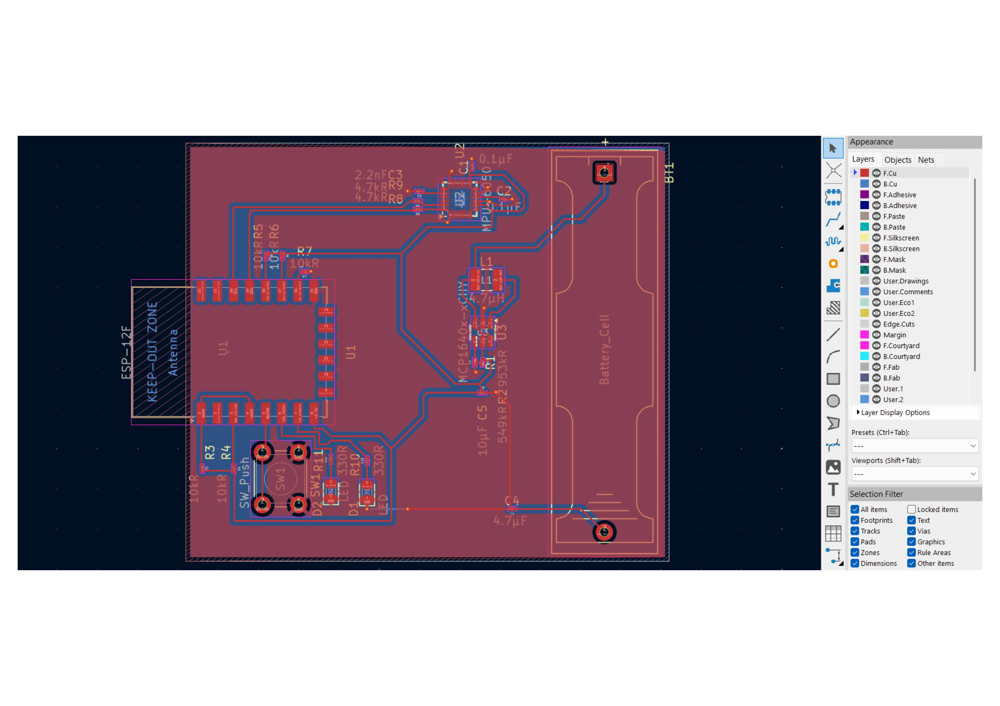

# ESP8266 Wireless IMU Node (PCB Design) 📡

## 📋 Proje Özeti (Overview)
Bu proje, **IoT (Nesnelerin İnterneti)** uygulamaları için tasarlanmış, batarya beslemeli, kompakt ve bağımsız bir **Kablosuz Hareket Sensörü (Wireless Motion Sensor)** düğümüdür.

Kart, üzerindeki **MPU-6050** sensörü sayesinde ivme ve jiroskop verilerini okur ve **ESP8266 (ESP-12F)** modülü üzerinden Wi-Fi ağına (MQTT, TCP/UDP vb.) gönderir. Tek bir pil hücresi ile çalışabilmesi için dahili voltaj yükseltici (Boost Converter) devresi içerir.

## 🛠️ Teknik Özellikler (Technical Specifications)

| Özellik | Detay |
| :--- | :--- |
| **Mikrodenetleyici** | ESP-12F (ESP8266 Wi-Fi SoC) |
| **Sensör** | MPU-6050 (3-Eksen İvmeölçer + 3-Eksen Jiroskop) |
| **Güç Kaynağı** | 1x AA veya Li-Ion Pil Hücresi |
| **Güç Yönetimi** | **MCP1640** Boost Converter (0.8V girişten 3.3V çıkış üretir) |
| **Kullanıcı Arayüzü** | 1x Programlanabilir Buton, 2x Durum LED'i |
| **Anten** | PCB üzeri dahili anten (Keep-out zone tasarımı uygulanmıştır) |
| **Tasarım Aracı** | KiCad EDA |

## 📸 Tasarım Görselleri (Design Gallery)

### 1. 3D Görünüm (3D Render)
Kartın son halinin 3 boyutlu render görüntüsü. Pil yuvası ve ESP modülünün yerleşimi optimize edilmiştir.

### 2. PCB Yerleşimi (Layout & Routing)
Çift katmanlı (2-Layer) tasarım. RF (Anten) kısmında sinyal bütünlüğü için "Keep-out" alanlarına dikkat edilmiştir. Güç hatları (Power planes) gürültüyü azaltmak için geniş tutulmuştur.

### 3. Devre Şeması (Schematic)
Sistemin güç yönetimi ve sensör bağlantılarını gösteren devre şeması.

## 🚀 Kullanım Alanları
* Uzaktan titreşim analizi (Makine sağlığı izleme).
* Giyilebilir teknolojiler (Adım sayar, düşme algılama).
* Robotik projeler için kablosuz sensör modülü.
* Akıllı ev otomasyonu tetikleyicileri.

---
**Lisans:** MIT License
